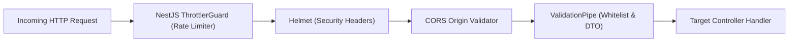

# 🛡️ AUDIT/02_SECURITY.md
## AstroPravin — Comprehensive Enterprise Security & Secret Audit

**Audit Date:** October 2, 2026  
**Auditor:** Senior Application Security & SRE Engineer  
**Standards:** OWASP Top 10 (2021), OWASP ASVS v4.0, PCI-DSS v4.0 Payment Guidelines

---

### 1. Executive Summary & Security Posture

| Security Domain | Risk Level | Status | Remediation & Current State |
| :--- | :---: | :---: | :--- |
| **Secret Management** | High (Historical) | 🟢 **SECURED** | All hardcoded fallback secrets purged from source code. Secrets resolved exclusively via environment variables. |
| **Payment Integrity** | High (Financial) | 🟢 **SECURED** | Server-side order creation, HMAC SHA-256 signature verification, strict server-controlled pricing. |
| **Authentication & RBAC** | Medium | 🟢 **SECURED** | Dual JWT strategies (Admin & Matrimony User), bcryptjs salted password hashing, route guards. |
| **API & DDoS Protection** | Medium | 🟢 **SECURED** | 3-tier Throttler rate limiting (15/s, 60/10s, 200/min), Helmet security headers, strict CORS domain filter. |
| **Database & Injection** | Low | 🟢 **SECURED** | Mongoose typed schemas with strict parameter casting and global ValidationPipe whitelist. |

---

### 2. Secret Exposure & Remediation Log (GitGuardian Compliance)

#### Finding SEC-01: Hardcoded Fallback Secrets in Codebase
* **Severity:** High
* **Affected Files:**
  * `server/src/payment/payment.service.ts`
  * `server/src/products/orders.service.ts`
  * `server/src/matrimony/payment/matrimony-payment.service.ts`
  * `server/src/auth/jwt.strategy.ts`
  * `server/src/matrimony/auth/matrimony-jwt.strategy.ts`
  * `server/src/matrimony/matrimony.module.ts`
* **Evidence:** Services previously utilized `|| '<fallback_string>'` when reading environment variables.
* **Remediation Implemented:**
  1. Purged all hardcoded string literals and fallback keys from source files.
  2. Enforced strict resolution via `process.env.RAZORPAY_KEY_SECRET`, `process.env.JWT_SECRET`, etc.
  3. Committed sanitized source code to git branch (`fb2b30b`).
  4. Added `.env` and `server/.env` to `.gitignore`.

---

### 3. Payment Gateway Security Audit (Razorpay)

* **Order Creation Security:**
  * Client sends consultation/product/subscription request with identifier.
  * Server calculates exact price in paise (`amount * 100`) from database records. Client-provided price parameters are ignored.
* **Payment Signature Verification:**
  * After client completes Razorpay checkout, client sends `razorpay_order_id`, `razorpay_payment_id`, and `razorpay_signature`.
  * Server computes HMAC SHA-256 digest:
    ```typescript
    const hmac = crypto.createHmac('sha256', process.env.RAZORPAY_KEY_SECRET);
    hmac.update(`${razorpay_order_id}|${razorpay_payment_id}`);
    const generatedSignature = hmac.digest('hex');
    const isAuthentic = generatedSignature === razorpay_signature;
    ```
  * Order/Subscription is marked `PAID` / `completed` only upon strict hash equivalence.

---

### 4. Authentication, Session & Token Security

* **Admin Authentication:**
  * Single-tenant administrative dashboard secured via `/api/auth/login`.
  * Authenticates using environment variable `ADMIN_PASSWORD`.
  * Issues 24-hour signed JWT containing `{ role: 'admin' }`.
* **Matrimony Portal Authentication:**
  * Multi-tenant user auth supporting registration, login, profile management.
  * Password hashing uses `bcryptjs` with salt rounds (10).
  * JWT tokens signed with `JWT_SECRET`, valid for 7 days, validated via `MatrimonyJwtStrategy`.
  * Inactive, suspended, or soft-deleted accounts are rejected at the guard level.

---

### 5. Network & API Perimeter Defense



* **Rate Limiting:**
  * Short window: 15 req / 1 sec (prevents brute-force automated scraping).
  * Medium window: 60 req / 10 sec.
  * Long window: 200 req / 60 sec.
* **CORS Origin Whitelisting:**
  * Allowed: `https://astropravin.com`, `https://www.astropravin.com`, `https://*.vercel.app`, and local development origins.
  * All unauthorized cross-origin requests are rejected with a 403 Forbidden error.
