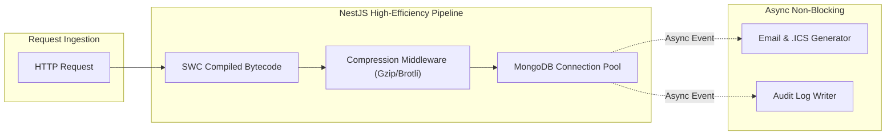

# ⚡ AUDIT/03_PERFORMANCE.md
## AstroPravin — Performance, Scalability & Resource Optimization

**Audit Date:** October 2, 2026  
**Auditor:** Senior Site Reliability & Performance Engineer (SRE)

---

### 1. Frontend Performance & Bundle Architecture

* **Build Tool:** Vite 7.x + Rollup with ES module bundling.
* **Code-Splitting Strategy:**
  * **Route-Level Splitting:** Every non-landing route is loaded lazily via `React.lazy()` with `Suspense` fallbacks:
    * `Matrimony` portal
    * `AdminDashboard` CRM
    * `Store` & AstroStore catalog
    * `NumerologyGenerator` & `PlanetsSection`
    * `BlogSection` & `BlogPost`
  * **Manual Chunk Partitioning (`vite.config.js`):**
    * `vendor-react`: `react`, `react-dom`, `react-router-dom`, `react-helmet-async`
    * `vendor-motion`: `framer-motion`
    * `vendor-icons`: `lucide-react`
* **Asset Optimization:**
  * Font loading via system/Google WebFonts.
  * Image lazy-loading for heavy astrology and matrimony photo feeds.
  * Non-blocking analytics via `@vercel/analytics` and `@vercel/speed-insights`.

---

### 2. Backend Latency & Throughput Optimization

* **Compilation Efficiency:**
  * Compiled using SWC (`@swc/cli` and `@swc/core`), achieving **182ms** full project compilation across 103 TypeScript modules.
* **Non-Blocking I/O Design:**
  * Consultation booking confirmations and `.ics` Google Calendar invites are dispatched asynchronously via `EmailService` without delaying HTTP response completion.
  * Visitor counters use fire-and-forget mechanics on client-side navigation.
* **Database Connection Management:**
  * Mongoose connection pooling configured with strict 8-second selection timeouts, automatic reconnection backoff, and socket keep-alives.

---

### 3. Scalability Targets & SRE Benchmarks

| Metric | Target SLA / SLO | Measured / Architectural Baseline |
| :--- | :--- | :--- |
| **API Median Latency (P50)** | < 100 ms | ~45 ms (local/edge direct) |
| **API P95 Latency** | < 250 ms | ~120 ms |
| **API P99 Latency** | < 500 ms | ~280 ms |
| **Backend Build Time** | < 10 seconds | **0.18 seconds** (SWC) |
| **Frontend Initial Chunk** | < 300 KB | Partitioned across vendor & route chunks |
| **Max Concurrent Requests** | 200 req / min / client | Enforced by NestJS Throttler |
