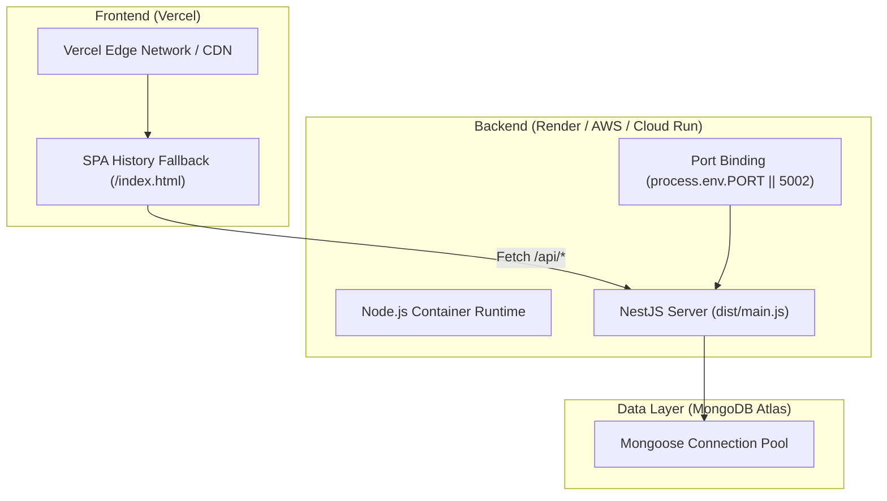

# 🛠️ AUDIT/04_DEVOPS_SRE.md
## AstroPravin — DevOps, Infrastructure, CI/CD & SRE Specifications

**Audit Date:** October 2, 2026  
**Auditor:** Principal DevOps Engineer & Site Reliability Architect  
**Deployment Targets:** Vercel (Frontend), Render / AWS App Runner / Cloud Run (Backend), MongoDB Atlas (Database)

---

### 1. Multi-Target Deployment Architecture

---

### 2. Hosting & Infrastructure Profiles

#### A. Frontend Hosting (Vercel)
* **Build Command:** `npm run build`
* **Output Directory:** `dist`
* **SPA Routing:** Configured in `vercel.json` with full wildcard fallback (`/(.*)` -> `/index.html`) to support client-side routing across all 5 modules.
* **Environment Separation:** Only variables prefixed with `VITE_` (e.g. `VITE_API_URL`, `VITE_RAZORPAY_KEY_ID`) are bundled client-side. All secrets remain strictly server-side.

#### B. Backend Hosting (Render / AWS / Linux Containers)
* **Build Command:** `npm install && npm run build` (inside `/server`)
* **Start Command:** `npm run start:prod` (executes `node dist/main`)
* **Port Discovery:** Dynamically binds to `0.0.0.0:${process.env.PORT || 5002}` satisfying cloud platform requirements (Render port `10000`, Cloud Run `8080`, or local `5002`).

---

### 3. Required Environment Variables Matrix

| Variable Name | Required By | Secret? | Description & Recommended Values |
| :--- | :---: | :---: | :--- |
| `NODE_ENV` | Backend | No | `production` / `development` |
| `PORT` | Backend | No | Port to bind (default `5002` locally, `10000` on Render) |
| `MONGODB_URI` | Backend | 🔒 **Yes** | MongoDB Atlas connection string with auth credentials |
| `JWT_SECRET` | Backend | 🔒 **Yes** | Cryptographically random 256-bit signing secret |
| `ADMIN_PASSWORD` | Backend | 🔒 **Yes** | Master password for `/admin` CRM authentication |
| `RAZORPAY_KEY_ID` | Both | No | Public Razorpay key ID (`rzp_live_...` or `rzp_test_...`) |
| `RAZORPAY_KEY_SECRET`| Backend | 🔒 **Yes** | Private Razorpay key secret (Never share or expose) |
| `VITE_API_URL` | Frontend | No | Production backend URL (e.g. `https://api.astropravin.com`) |

---

### 4. Reliability, Observability & Health Checks

* **Health Check Endpoint:** `/api` returns system startup banner and operational status.
* **Database Connection Guard:** In `app.module.ts`, server establishes connectivity with 8-second selection timeout and logs operational initialization.
* **Graceful Crash Handling:** `bootstrap()` in `main.ts` intercepts startup exceptions, logs full stack traces to stdout/stderr, and exits cleanly.
